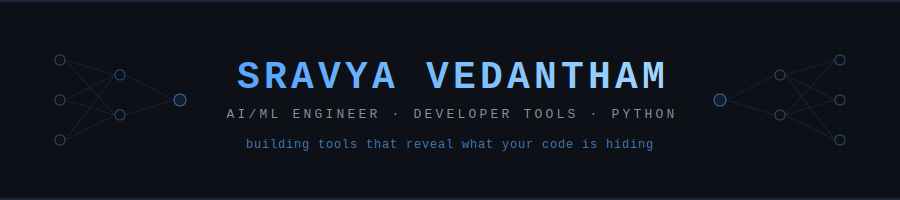

<div align="center">
  
</div>

<br/>

<div align="center">

[](https://git.io/typing-svg)

<br/>

[](https://dev.to/lakshmisravyavedantham)
&nbsp;
[](https://www.linkedin.com/in/lakshmisravyavedantham/)
&nbsp;
[](https://sravyavedantham.com)
&nbsp;
[](https://www.youtube.com/@dumdumhum)

</div>

---

### `IDENTITY`

```yaml
name     : Sravya Vedantham
role     : AI Engineer  ·  Agentic AI  ·  Video Generation Research
location : United States
focus    : autonomous agents, multi-agent orchestration, AI-powered video pipelines
writing  : 30 articles on Dev.to — AI, Python, Rust, DevTools
status   : open to new ideas & collaborations
belief   : "Build tools that think for themselves — then open-source them."
```

---

### `FLAGSHIP`

> **[secret-time-machine](https://github.com/LakshmiSravyaVedantham/secret-time-machine)** — scans your entire git history for secrets that were committed and "deleted". The key you removed in 2023 is still in commit `a4f8c2d`. This tool finds it.
>
> `pip install secret-time-machine`

---

### `>_ AI INFRASTRUCTURE`

Tools that change how AI agents think, act, and deploy.

| tool | what it does |
|------|-------------|
| [**assemble**](https://github.com/LakshmiSravyaVedantham/assemble) | multi-agent orchestrator — assembles AI teams, runs them in parallel with wave execution |
| [**mem-mesh**](https://github.com/LakshmiSravyaVedantham/mem-mesh) | universal AI memory layer — drop-in proxy that gives Claude persistent memory across conversations |
| [**guardian**](https://github.com/LakshmiSravyaVedantham/guardian) | autonomous code guardian — Claude agent that scans your repo and opens PRs with fixes |
| [**llm-guard**](https://github.com/LakshmiSravyaVedantham/llm-guard) | AI agent bodyguard — catches leaked keys, runaway loops, and budget burns before they happen |
| [**llm-lens**](https://github.com/LakshmiSravyaVedantham/llm-lens) | flight recorder for AI agents — replay every decision an agent made |
| [**llm-bench**](https://github.com/LakshmiSravyaVedantham/llm-bench) | LLM benchmarking tool — side-by-side model comparison with real metrics |
| [**nlops**](https://github.com/LakshmiSravyaVedantham/nlops) | natural language DevOps — plain English to production-ready Terraform |
| [**skillforge**](https://github.com/LakshmiSravyaVedantham/skillforge) | AI skill compiler — plain English workflows to production-ready agents |
| [**clipforge**](https://github.com/LakshmiSravyaVedantham/clipforge) | AI video pipeline — raw gameplay to TikTok/YouTube/trailer clips automatically |

---

### `PRIVACY & SECURITY`

| tool | what it does |
|------|-------------|
| [**shadowscan**](https://github.com/LakshmiSravyaVedantham/shadowscan) | scans what AI can see about you — env vars, SSH keys, clipboard, git history |
| [**datawipe**](https://github.com/LakshmiSravyaVedantham/datawipe) | automates GDPR/CCPA right-to-erasure requests for 55+ companies |
| [**consentmap**](https://github.com/LakshmiSravyaVedantham/consentmap) | privacy policy scanner — plain-English risk summary, no LLM required |
| [**ai-opt-out**](https://github.com/LakshmiSravyaVedantham/ai-opt-out) | generates opt-out requests to 15 AI companies training on your data |
| [**inboxscan**](https://github.com/LakshmiSravyaVedantham/inboxscan) | scans Gmail for forgotten subscriptions burning your money |

---

### `TOOLS`

| tool | what it reveals |
|------|----------------|
| [**git-personality**](https://github.com/LakshmiSravyaVedantham/git-personality) | your D&D alignment from commit history |
| [**hallucination-grep**](https://github.com/LakshmiSravyaVedantham/hallucination-grep) | functions your LLM invented that don't exist |
| [**token-diet**](https://github.com/LakshmiSravyaVedantham/token-diet) | wasted tokens burning your LLM budget |
| [**llm-model-diff**](https://github.com/LakshmiSravyaVedantham/model-diff) | exactly where GPT-4 and Claude disagree |
| [**dev-dna**](https://github.com/LakshmiSravyaVedantham/dev-dna) | your developer archetype from GitHub history |
| [**commit-prophet**](https://github.com/LakshmiSravyaVedantham/commit-prophet) | which files will have the next bug |
| [**vibe-check**](https://github.com/LakshmiSravyaVedantham/vibe-check) | how much of your codebase an AI wrote |
| [**prompt-rs**](https://github.com/LakshmiSravyaVedantham/prompt-rs) | type-safe LLM prompts in Rust — catch prompt bugs at compile time |
| [**ctx-kit**](https://github.com/LakshmiSravyaVedantham/ctx-kit) | 5MB Rust binary between your code and every LLM API — cut your bill by 40% |

---

### `WRITING`

30 articles · [dev.to/lakshmisravyavedantham](https://dev.to/lakshmisravyavedantham)

<details>
<summary>latest</summary>

- [I scanned my Gmail and found $91/mo in subscriptions I completely forgot about](https://dev.to/lakshmisravyavedantham/i-built-a-tool-that-scans-your-gmail-and-finds-every-subscription-you-forgot-about-4gc2)
- [I built a Claude Code skill that assembles AI teams and runs them in parallel](https://dev.to/lakshmisravyavedantham/i-built-a-claude-code-skill-that-assembles-ai-teams-and-runs-them-in-parallel-50ab)
- [Type-safe LLM prompts in Rust: catching prompt bugs before they happen](https://dev.to/lakshmisravyavedantham/type-safe-llm-prompts-in-rust-catching-prompt-bugs-before-they-happen-2nnf)
- [I built the LLM benchmarking tool every AI dev needs (in Rust)](https://dev.to/lakshmisravyavedantham/i-built-the-llm-benchmarking-tool-every-ai-dev-needs-in-rust-d0k)
- [I rewrote LangChain in 300 lines of Rust (and here's what I found)](https://dev.to/lakshmisravyavedantham/i-rewrote-langchain-in-300-lines-of-rust-and-heres-what-i-found-444n)

</details>

---

### `STACK`

<div align="center">

[](https://skillicons.dev)

</div>

---

### `PLAY`

<div align="center">
  <a href="https://LakshmiSravyaVedantham.github.io/LakshmiSravyaVedantham/game/runner/"></a>
  &nbsp;
  <a href="https://LakshmiSravyaVedantham.github.io/LakshmiSravyaVedantham/game/2048/"></a>
</div>
