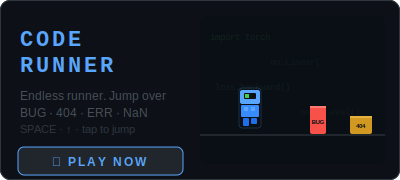
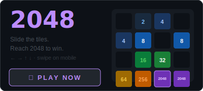

<div align="center">

[](https://git.io/typing-svg)

</div>

---

<div align="center">

```python
>>> import dev_dna
>>> dev_dna.scan("lakshmisravyavedantham")

  ARCHETYPE  →  The Toolsmith
  SIGNAL     →  Makes the invisible visible
  VELOCITY   →  4.5 repos/month  ▸  top 5% of GitHub
  LANGUAGE   →  Python ████████████  TypeScript ████  JS ██
  EVOLVING   →  Python (2022)  →  Python + TypeScript + AI (now)
  TRAIT [+]  →  Ships fast. Asks why. Builds twice.
  TRAIT [+]  →  17 articles. Still writing.
  TRAIT [-]  →  108 repos. Not all of them deserve to exist.
  INSIGHT    →  "The bottleneck isn't output. It's surface area."
```

</div>

---

<div align="center">

<a href="https://dev.to/lakshmisravyavedantham"></a>
&nbsp;
<a href="https://www.linkedin.com/in/sravyavedantham/"></a>
&nbsp;
<a href="https://sravyavedantham.com"></a>
&nbsp;


</div>

---

## what i build

> pip-installable tools that surface what stays hidden by default

| tool | what it finds | |
|------|--------------|--|
| [**git-personality**](https://github.com/LakshmiSravyaVedantham/git-personality) | your D&D alignment from commit history | [](https://pypi.org/project/git-personality/) |
| [**hallucination-grep**](https://github.com/LakshmiSravyaVedantham/hallucination-grep) | functions your LLM invented that don't exist | [](https://pypi.org/project/hallucination-grep/) |
| [**secret-time-machine**](https://github.com/LakshmiSravyaVedantham/secret-time-machine) | API keys you "deleted" 2 years ago | [](https://pypi.org/project/secret-time-machine/) |
| [**token-diet**](https://github.com/LakshmiSravyaVedantham/token-diet) | wasted tokens burning your LLM budget | [](https://pypi.org/project/token-diet/) |
| [**llm-model-diff**](https://github.com/LakshmiSravyaVedantham/model-diff) | exactly where GPT-4 and Claude disagree | [](https://pypi.org/project/llm-model-diff/) |
| [**dev-dna**](https://github.com/LakshmiSravyaVedantham/dev-dna) | your developer archetype from GitHub history | [](https://pypi.org/project/dev-dna/) |
| [**commit-prophet**](https://github.com/LakshmiSravyaVedantham/commit-prophet) | which files will have the next bug | [](https://pypi.org/project/commit-prophet/) |
| [**vibe-check**](https://github.com/LakshmiSravyaVedantham/vibe-check) | how much of your codebase an AI wrote | [](https://pypi.org/project/vibe-check/) |

---

## writing

17 articles on [Dev.to](https://dev.to/lakshmisravyavedantham) — Python · AI · DevTools · things I had to build to understand

<details>
<summary>latest posts</summary>

- [I Built 23andMe for Developers — Mine Said I'm a Chaotic Hacker](https://dev.to/lakshmisravyavedantham/i-built-23andme-for-developers-mine-said-im-a-chaotic-hacker-with-a-velocity-problem-1cph)
- [I Found an API Key I Deleted 18 Months Ago Still Living in My Git History](https://dev.to/lakshmisravyavedantham/i-found-an-api-key-i-deleted-18-months-ago-still-living-in-my-git-history-1328)
- [I Built a Lie Detector for LLM Output — It Found 4 Functions That Don't Exist](https://dev.to/lakshmisravyavedantham/i-built-a-lie-detector-for-llm-output-it-found-4-functions-that-dont-exist-in-my-codebase-4204)
- [I Ran My Git History Through a D&D Alignment Test — It Called Me Chaotic Evil](https://dev.to/lakshmisravyavedantham/i-ran-my-git-history-through-a-dd-alignment-test-it-called-me-chaotic-evil-5fn9)

</details>

---

## stack

<div align="center">

[](https://skillicons.dev)

</div>

---

## contribution map

<div align="center">

<picture>
  <source media="(prefers-color-scheme: dark)" srcset="https://raw.githubusercontent.com/LakshmiSravyaVedantham/LakshmiSravyaVedantham/output/github-contribution-grid-snake-dark.svg" />
  <source media="(prefers-color-scheme: light)" srcset="https://raw.githubusercontent.com/LakshmiSravyaVedantham/LakshmiSravyaVedantham/output/github-contribution-grid-snake.svg" />
  
</picture>

</div>

---

## stats

<div align="center">


</div>

---

## play

<div align="center">
  <a href="https://LakshmiSravyaVedantham.github.io/LakshmiSravyaVedantham/game/runner/"></a>
  &nbsp;
  <a href="https://LakshmiSravyaVedantham.github.io/LakshmiSravyaVedantham/game/2048/"></a>
</div>

---


