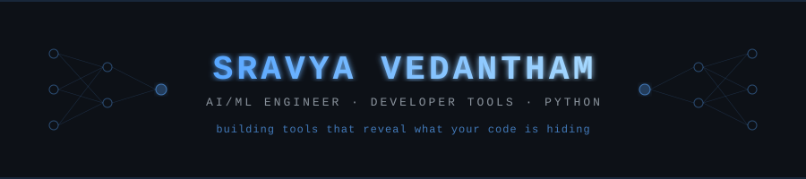
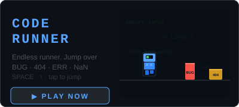
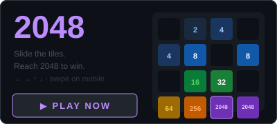

<div align="center">
  
</div>

<br/>

<div align="center">

[](https://git.io/typing-svg)

<br/>

[](https://dev.to/lakshmisravyavedantham)
&nbsp;
[](https://www.linkedin.com/in/lakshmisravyavedantham/)
&nbsp;
[](https://sravyavedantham.com)
&nbsp;
[](https://www.youtube.com/@dumdumhum)

</div>

---

### `IDENTITY`

```yaml
name     : Sravya Vedantham
role     : AI Engineer  ·  Agentic AI  ·  Video Generation Research
location : United States
focus    : autonomous agents, multi-agent orchestration, AI-powered video pipelines
writing  : 33 articles on Dev.to — AI, Python, Rust, Privacy, DevTools
status   : open to new ideas & collaborations
belief   : "Build tools that think for themselves — then open-source them."
```

---

### `STACK`

<div align="center">

[](https://skillicons.dev)

</div>

---

### `PLAY`

<div align="center">
  <a href="https://LakshmiSravyaVedantham.github.io/LakshmiSravyaVedantham/game/runner/"></a>
  &nbsp;
  <a href="https://LakshmiSravyaVedantham.github.io/LakshmiSravyaVedantham/game/2048/"></a>
</div>
